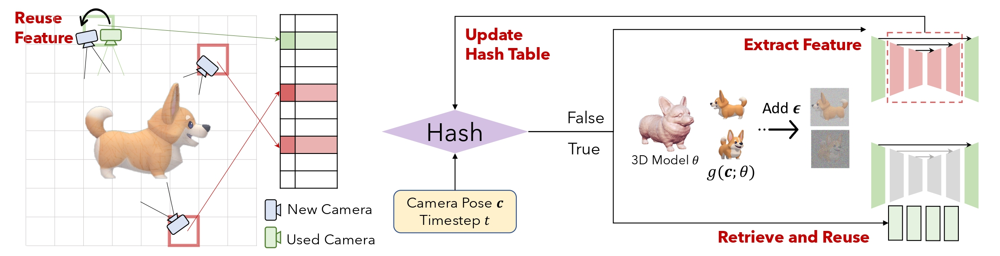

<br>
<div align="center">
</img>
<h3>Training-free Acceleration <br> for 3D Generation 🏎️💨<h3>
</div>


## Introduction
This repository contains the offical implementation for our paper

Hash3D: Training-free Acceleration for 3D Generation

[[project page](https://adamdad.github.io/hash3D/)] [[paper](https://arxiv.org/abs/2404.06091)] [[code](https://github.com/Adamdad/hash3D)]




> We present, Hash3D, a universal solution to acclerate score distillation samplin (SDS) based 3D generation. By effectively hashing and reusing these feature maps across neighboring timesteps and camera angles, Hash3D substantially prevents redundant calculations, thus accelerating the diffusion model's inference in 3D generation tasks.

**What we offer**: 
- ⭐ Compatiable to Any 3D generation method using SDS.
- ⭐ Inplace Accerlation for 1.3X - 4X. 
- ⭐ Training-Free.

## Visualizations


<section class="section">
  <div class="container is-max-desktop">
    <div class="columns is-centered">
      <div class="column is-full-width">
        <h3 class="title is-3">Image-to-3D Results</h3>
        <div class="content has-text-justified">
          <table>
            <tr>
              <th>Input Image</th>
              <th>Zero-1-to-3</th>
              <th>Hash3D + Zero-1-to-3<span style="color:red">(Speed X3.3)</span></th>
            </tr>
            <tr>
              <td></td>
              <td>

https://github.com/Adamdad/hash3D/assets/26020510/797d78f0-d2d7-43a3-94af-bf57c9c5ef70

</td>
              <td>

https://github.com/Adamdad/hash3D/assets/26020510/c02701f1-fd92-4601-8569-18c7c17cde97

</td>
            </tr>
            <tr>
              <td></td>
              <td>

https://github.com/Adamdad/hash3D/assets/26020510/a41ba688-40bf-4d95-95de-37b669a90887

</td>
              <td>

https://github.com/Adamdad/hash3D/assets/26020510/86d9e46d-0554-4a87-9960-ce3a9f83bdd7

</td>
            </tr>
          </table>
        </div>
      </div>
    </div>
  </div>

## Project Structure
The repository is organized into three main directories, each catering to a different repo that Hash3D can be applied on:

1. `threesdtudio-hash3d`: Contains the implementation of Hash3D tailored for use with the [`threestudio`](https://github.com/threestudio-project/threestudio).
2. `dreamgaussian-hash3d`: Focuses on integrating Hash3D with the DreamGaussian for image-to-3D generation.
3. `gaussian-dreamer-hash3d`: Dedicated to applying Hash3D to GaussianDreamer for faster text-to-3D tasks.

### What we add?
The core implementation is in the `guidance_loss` for each SDS loss computation. We 

See `hash3D/threestudio-hash3d/threestudio/models/guidance/zero123_unified_guidance_cache.py` for example. The code for the hash table implementation is in `hash3D/threestudio-hash3d/threestudio/utils/hash_table.py`.

## Getting Started

### Installation
Navigate to each of the specific directories for environment-specific installation instructions.

### Usage
Refer to the `README` within each directory for detailed usage instructions tailored to each environment.

For example, to run Zero123+SDS with hash3D
```shell
cd threestudio-hash3d
python launch.py --config configs/stable-zero123_hash3d.yaml --train --gpu 0 data.image_path=https://adamdad.github.io/hash3D/load/images/dog1_rgba.png
```

### Evaliation
1. **Image-to-3D**: GSO dataset GT meshes and renderings can be found online. With the rendering of the reconstructed 3D objects at `pred_dir` and the gt rendering at `gt_dir`, run

```shell
python eval_nvs.py --gt $gt_dir --pr $pred_dir 
```
2. **Text-to-3D**: Run all the prompts in `assets/prompt.txt`. And compute the CLIP score between text and rendered image as
```shell
python eval_clip_sim.py "$gt_prompt" $pred_dir --mode text
```

## Acknowledgement

We borrow part of the code from [DeepCache](https://github.com/horseee/DeepCache) for feature extraction from diffusion models. 
We also thanks the implementation from [threestudio](https://github.com/threestudio-project/threestudio), [DreamGaussian](https://github.com/dreamgaussian/dreamgaussian), [Gaussian-Dreamer](https://github.com/hustvl/GaussianDreamer), and the valuable disscussion with [@FlorinShum](https://github.com/FlorinShum) and [@Horseee](https://github.com/horseee).

## Citation

```bibtex
@misc{yang2024hash3d,
      title={Hash3D: Training-free Acceleration for 3D Generation}, 
      author={Xingyi Yang and Xinchao Wang},
      year={2024},
      eprint={2404.06091},
      archivePrefix={arXiv},
      primaryClass={cs.CV}
}
```
